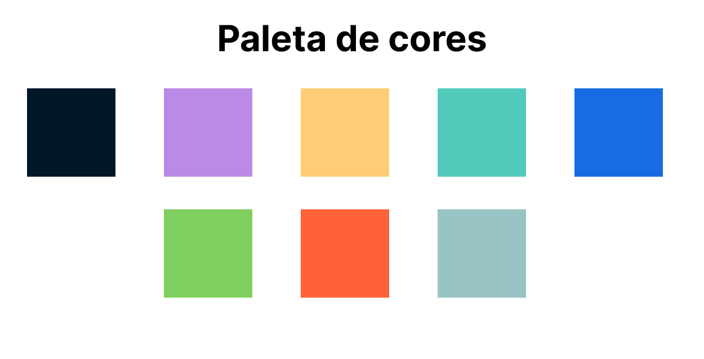
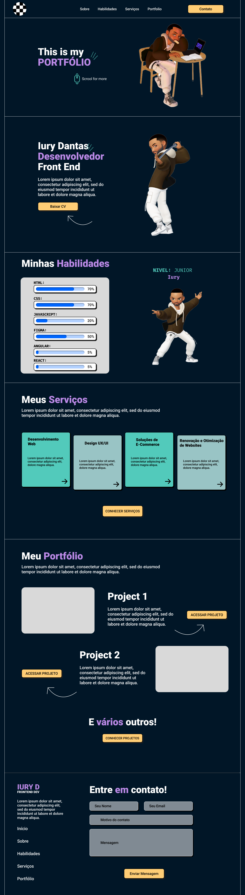

# Meu Portfólio

## Projeto criado para conclusão do curso de Web Designer - Front-end do Senai

### Descrição do Projeto

Este projeto representa a conclusão do curso de Web Designer - Front-end do Senai. É um portfólio pessoal que destaca minhas habilidades, experiências e projetos, criado com o objetivo de demonstrar meu conhecimento em design e desenvolvimento web.

### Identidade Visual

#### Paleta de Cores

A paleta de cores foi escolhida para transmitir profissionalismo e modernidade, com tons suaves que proporcionam uma experiência visual agradável aos visitantes.

### Protótipo Figma

#### Protótipo de Alta Fidelidade

O protótipo de alta fidelidade foi desenvolvido utilizando a plataforma Figma, garantindo uma representação fiel do design final do projeto.

### Tecnologias Utilizadas

- **HTML:** Estruturação da página.
- **CSS:** Estilização para uma apresentação visual atraente.
- **JavaScript:** Adição de funcionalidades interativas e dinâmicas.

### Estrutura do Projeto

- **index.html:** Página principal do portfólio.
- **style.css:** Estilos para a apresentação visual.
- **script.js:** Adição de funcionalidades interativas.

### Destaques

- **Seção de Habilidades:** Destaca minhas habilidades principais em design e desenvolvimento.
- **Portfólio:** Apresenta alguns dos meus melhores projetos com links para visualização.
- **Serviços:** Descreve os serviços que ofereço, como desenvolvimento web, design UX/UI, e-commerce, e otimização de websites.

### Como Contribuir

Este projeto foi concluído para fins educativos e não está aberto a contribuições externas. No entanto, feedbacks são sempre bem-vindos!

### Próximos Passos

- Implementar responsividade para garantir uma experiência consistente em dispositivos móveis.
- Adicionar links dos projetos.
- Adicionar seção de depoimentos de clientes ou colegas de trabalho.
- Explorar integrações com APIs para atualizações dinâmicas de projetos.

**Nota:** Este projeto foi desenvolvido como parte do curso de Web Designer - Front-end do Senai e serve como um portfólio pessoal para demonstrar minhas habilidades e conquistas na área de design e desenvolvimento web.
